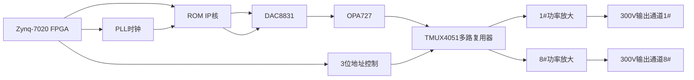

```mermaid
graph LR
A[Zynq-7020 FPGA] --> B[ROM IP核] 
A --> C[PLL时钟] --> B
B --> D[DAC8831] 
B --> D[DAC8831] 
D --> E[OPA727] --> F[TMUX4051多路复用器]
F --> H[1#功率放大] --> I[300V输出通道1#]
F --> J[8#功率放大] --> K[300V输出通道8#]
A --> G[3位地址控制] --> F
```