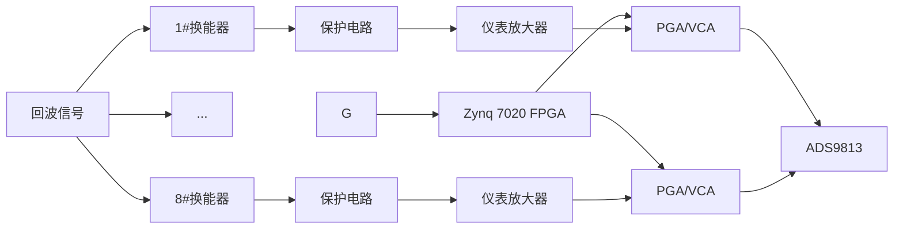

```mermaid
graph LR
A[回波信号]
A --> B1[1#换能器]
A --> ...
A --> B8[8#换能器]

B1 --> C1[保护电路]
B8 --> C8[保护电路]

C1 --> D1[仪表放大器]
C8 --> D8[仪表放大器]
H[Zynq 7020 ARM] --> E1
H[Zynq 7020 ARM] --> E8
D1 --> E1[PGA/VCA]
D8 --> E8[PGA/VCA]

E1 --> F[ADS9813]
E8 --> F[ADS9813] 

G --> H[Zynq 7020 FPGA]


```