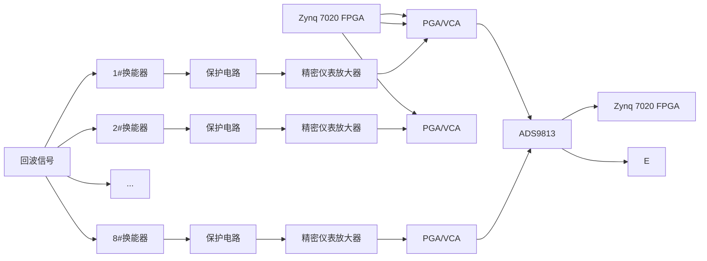

```mermaid
graph LR
A[回波信号]
A --> B1[1#换能器]
A --> B2[2#换能器]
A --> ...
A --> B8[8#换能器]
B1 --> C1[保护电路]
B2 --> C2[保护电路]
B8 --> C8[保护电路]
H[Zynq 7020 FPGA] --> E1
H[Zynq 7020 FPGA] --> E2
H[Zynq 7020 FPGA] --> E1
C1 --> D1[精密仪表放大器]
C2 --> D2[精密仪表放大器] 
C8 --> D8[精密仪表放大器] 
D1 --> E1[PGA/VCA]
D2 --> E2[PGA/VCA] 
D8 --> E8[PGA/VCA] 
E1 --> F[ADS9813]
E8 --> F[ADS9813] 
F --> G[Zynq 7020 FPGA]
F --> E

```