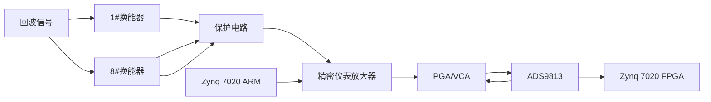

```mermaid
graph LR
A[回波信号]
A --> B1[1#换能器]
A --> B2[8#换能器]
B1 --> C[保护电路]
B2 --> C[保护电路]
B2 --> C[保护电路] 
C --> D[精密仪表放大器] 
D --> E[PGA/VCA] 
E --> F[ADS9813] 
F --> G[Zynq 7020 FPGA]
H[Zynq 7020 ARM] --> D
F --> E

```